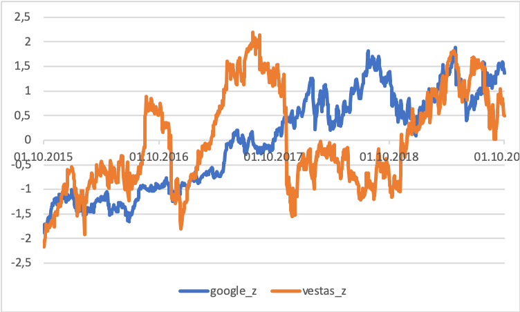

S4: Fra varians til korrelation 
===


<!-- $size: 16:9 -->

<!--- $theme: gaia 
---> 

##### Anvendt Statistik - E2020


###### Roman Jurowetzki, roman@business.aau.dk


---

# Sammenlignelighed


### ¯\\_(ツ)_/¯ - ikke så nemt at sige...

---
Google
$\sigma^2 = 30326,2$ 
$\sigma = 174,1$ 

Vestas
$\sigma^2 = 1642,6$
$\sigma = 40,5$

Kan vi finde en eller anden måde at sammenligne disse data?

JA! $\rightarrow$ Z-Scores eller Standardisering

---

# Z-scores / Standardisering

For at kunne sammenligne forandringer i 2 variable, der ikke ligger på en lignende skala skal vi finde en måde, at transformere vores værdiere således, at de afspejler forandring relativt til en "forventet afvigelse" for en variable.
Dvs.: Hvor mange standardafvigelser er vi væk fra gennemsnit?

- Vi kan gøre det ved at dele med vores standardafvigelse


$$ z_i = \frac{(x_i -\mu)}{\sigma} $$


 ```python
 data['variable'] - data['variable'].mean()/ data['variable'].std(ddof=0)
 
 # eller
 
import scipy.stats as stats

stats.zscore(data['variable'])
 ``` 
 
 
---



---

# So far so good

- Indtil videre har vi for det meste snakket om adskilte variable
- Nogle gange gar vi set på forskellige indikatorer beregnet på en variable med en bibetingelse (fx. gennemsnitlig alder vs. køn)
- I dag prøver vi at se på statistisk sammenhæng mellem 2 variable

---

# Lidt intuition?


---

# Korrelation intuition

Vi kan intuitivt se, at der må være sammenhæng mellem temperatur og hvor meget is der sælges
Hvordan kunne en indikator se ud, der beskriver intensiteten af vores "sammenhæng"?

- Intuition: Hvis *a* går op, så går også *b* op og omvendt
- Vi skal prøvet at måle denne fælles svingning
- Vi kan først beregne kovarians

$$ cov(i,j) = \frac{\sum_{i,j=1}^{N} (x_i -\mu_i)(x_j -\mu_j)}{N} $$

```
COV_E_F = SUM((Ei - AVERAGE(E:E)*(Fj - AVERAGE(F:F))) / COUNT(E:E)
```

```python
data[['variable1', 'variable2']].cov() #python
```


---

# Pearsons r

- Vores covariance er en spændende indikator men det er svært, at bruge det til noget. Problemet er, at den ikke er normeret.
- Vi kan løse problemet på en måde, der ligner vores standardisering fra tidligere


$$R = \frac {\frac{\sum_{i,j=1}^{N} (x_i -\mu_i)(x_j -\mu_j)}{N}}{\sigma_i . \sigma_j}$$
eller bare  
$$R = \frac {cov(i,j)}{\sigma_i . \sigma_j}$$


```Excel
=CORREL(E:E; F:F)
```
```python
data[['variable1', 'variable2']].corr() #python
```

---
# Hvordan kan vi interpretere det?

- Vi beregner Pearsons r eller r-værdi (eller meget nørdet Pearson's produkt-moment korrelationskoefficient)
- værdien af Pearsons r går fra -1 til 1.


